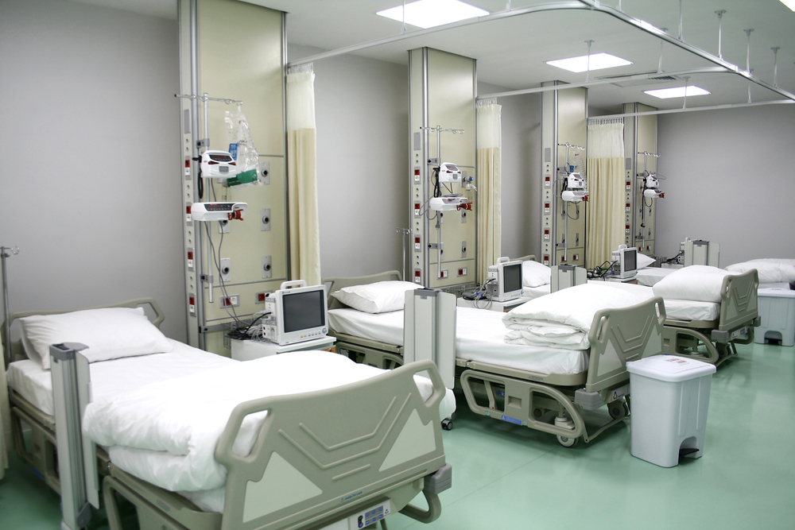

## Predicting patients with poor outcomes (hospital readmssions) from Medical Insurance Claims Data 

In this project, I am attempting to predict the patients with poor outcomes by using the frequency and duration of patient visit, their uasge of prescription drugs and other products & services. I do not have access to any medical information such as vitals, test results, scans or any other kind of diagnostic tests.

#### poor outcomes of (without much medical information about the patients? 

Prediciting Poor Outcomes from Medical Insurance Claims data with very limited medical information. 
